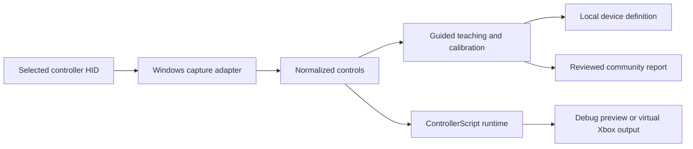

# ControllerOS

**ControllerOS — Program your controller. Teach it new hardware. Share what you discover.**

ControllerOS is a programmable controller platform. Write controller behavior
with ControllerScript, use the same normalized controls across devices, and
teach the system about an unknown generic HID controller.

[Download the Windows x64 experimental preview](https://github.com/TenchiNeko/ControllerOS/releases/download/v0.1.0-alpha.1/controlleros-0.1.0-alpha.1-win-x64.zip) ·
[First-use and hardware contribution guide](HARDWARE_CONTRIBUTION.md) ·
[Release notes](RELEASE_NOTES-v0.1.0-alpha.1.md)

> **Experimental:** physical controller compatibility needs community testing.
> ControllerOS does not claim universal support. A controller may expose only
> some of its controls through generic HID.

## What is in this preview

- A self-contained Windows CLI; installing the .NET SDK is not required.
- ControllerScript compilation, deterministic runtime, and profile simulation.
- Normalized buttons, sticks, triggers, and supported D-pad input.
- Windows HID discovery and selected-device input capture.
- Guided teaching and calibration for controls the selected HID interface exposes.
- A privacy-bounded hardware report that owners can review and contribute.
- Synthetic tests and an optional virtual Xbox output backend.

The software has passed automated tests and headless Windows VM checks. Those
checks used synthetic input and a virtual Xbox device; no physical controller
model has been maintainer-tested. The WPF desktop builds, but its interactive
behavior has not been tested and it is not included in the experimental ZIP.
See [PROJECT_STATUS.md](PROJECT_STATUS.md) for the validation record.

## First use

Download and extract the ZIP, open PowerShell in the extracted folder, then run:

```powershell
.\controlleros.exe --help
.\controlleros.exe version --json
.\controlleros.exe self-test
.\controlleros.exe devices
```

Choose the temporary ID shown for your controller and inspect or teach it:

```powershell
.\controlleros.exe inspect controller-001
.\controlleros.exe teach controller-001
```

Teaching prompts you to press or move standard controls, lets you skip
unavailable controls, previews the proposed mapping, then asks before saving.
The generated definition, per-unit calibration, and report are stored locally.
No physical-device definition is preloaded; teaching creates a local mapping.
Review and validate a copy of the report before sharing it. The full
step-by-step instructions and troubleshooting are in
[HARDWARE_CONTRIBUTION.md](HARDWARE_CONTRIBUTION.md).

## How ControllerOS works

The Windows adapter translates observed HID controls into a standard set of
buttons, axes, and triggers. ControllerScript uses those normalized controls,
so a profile can express behavior without depending on one manufacturer's raw
control numbering. When a device is unknown, the CLI guides its owner through
observations and uses the existing calibration engine to create a local
definition and separate calibration for that unit.



ControllerScript exists to make controller behavior programmable while keeping
profiles deterministic and sandboxed. It has no filesystem, network, process,
or arbitrary operating-system access. The implemented v0.1 syntax and limits
are documented in [CONTROLLERSCRIPT.md](CONTROLLERSCRIPT.md).

## What is and is not validated

| Evidence | Current state |
| --- | --- |
| Core, ControllerScript, profile validation, synthetic teaching | Automated tests pass |
| Windows CLI, HID enumeration, virtual output diagnostics | Headless Windows VM and CI checks pass |
| Physical controller button, stick, trigger, and D-pad behavior | Community-test-needed |
| Proprietary paddles, gyro, adaptive triggers, touchpads, LEDs, speakers | Unsupported unless the device exposes understood evidence |
| WPF desktop interactive behavior | Interactive-test-needed |
| Console support | Not included |

Synthetic fixtures verify software behavior; they do not establish physical
controller compatibility. Contribution reports distinguish
**maintainer-tested**, **contributor-tested**, **mapping-only**, and
**unverified** evidence. See [CONTRIBUTING.md](CONTRIBUTING.md).

## Community testing

Controller owners can teach a device without writing code, inspect the
privacy-bounded JSON report, and submit it with the **Controller Compatibility
Report** issue form. Review every report and attachment before uploading it.
The report exporter uses an allowlist and omits device paths, serial numbers,
host identity, IP addresses, unrelated hardware, and credentials.

Each useful hardware report expands the evidence available to future
contributors. Over time, repeated hardware contributions and code reviews can
grow the maintainer group and make device definitions easier to verify and
share. Read the [hardware guide](HARDWARE_CONTRIBUTION.md) or
[contribution guide](CONTRIBUTING.md) to participate.

## Build and validate from source

Development requires the .NET 10 SDK. From the repository root:

```sh
dotnet restore ControllerOS.sln
dotnet build ControllerOS.sln --configuration Release --no-restore
dotnet test ControllerOS.sln --configuration Release --no-build
dotnet format ControllerOS.sln --verify-no-changes --no-restore
dotnet run --project src/ControllerOS.Cli/ControllerOS.Cli.csproj -c Release -- self-test --json
dotnet run --project src/ControllerOS.Cli/ControllerOS.Cli.csproj -c Release -- validate examples/starter-profile.json
dotnet run --project src/ControllerOS.Cli/ControllerOS.Cli.csproj -c Release -- simulate examples/starter-profile.json
dotnet run --project src/ControllerOS.Cli/ControllerOS.Cli.csproj -c Release -- validate examples/stick-response-profile.json
```

The Windows CLI package is built from repository source in GitHub Actions and
includes its self-contained runtime, application dependencies, build identity,
two ControllerScript example profiles, license notices, and SHA-256 checksums.
The pinned HIDMaestro v1.11.0
archive and SDK DLL hashes, dependency licenses, and workflow permissions are
documented in [DEPENDENCIES.md](DEPENDENCIES.md).

## Scope and project history

This is a Windows-first experimental release. It does not support consoles,
every proprietary controller feature, or universal controller compatibility.
The WPF application and the headless CLI use the same core; the CLI is the
supported interface for this preview. ControllerOS does not implement
anti-cheat circumvention, detection evasion, enforcement-bypass identity
spoofing, process injection, game-memory manipulation, or packet manipulation.

Alpha 0.1 and the Headless Community Bridge remain recorded as historical
milestones in [FINAL_REPORT.md](FINAL_REPORT.md) and
[HEADLESS_BRIDGE_FINAL_REPORT.md](HEADLESS_BRIDGE_FINAL_REPORT.md). Current
status is in [PROJECT_STATUS.md](PROJECT_STATUS.md); architecture, report
schema, and governance are in [ARCHITECTURE.md](ARCHITECTURE.md),
[HARDWARE_REPORT.md](HARDWARE_REPORT.md), and [GOVERNANCE.md](GOVERNANCE.md).

## License

ControllerOS is licensed under the [Apache License 2.0](LICENSE).
