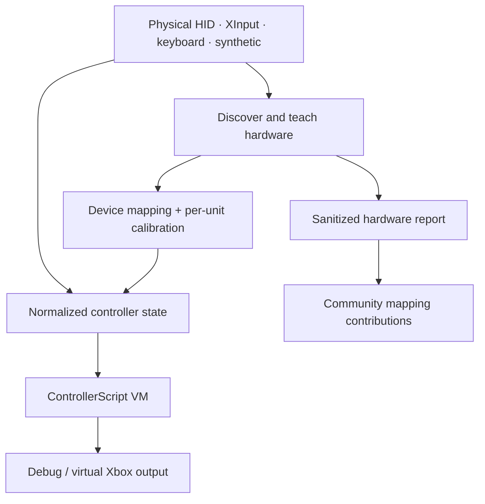

<h1 align="center">🎮 ControllerOS</h1>

<p align="center">
  <strong>ControllerOS — Program your controller. Teach it new hardware. Share what you discover.</strong>
</p>

<p align="center">
  An open-source, headless-first controller programming platform built for custom controls, accessibility, and community-driven hardware support.
</p>

<p align="center">
  <a href="https://github.com/TenchiNeko/ControllerOS/actions/workflows/ci.yml"></a>
  <a href="LICENSE"></a>
  
  
</p>

<p align="center">
  <a href="https://github.com/TenchiNeko/ControllerOS/releases/download/v0.1.0-alpha.1/controlleros-0.1.0-alpha.1-win-x64.zip"><strong>Download Windows ZIP · v0.1.0-alpha.1</strong></a>
  &nbsp;·&nbsp;
  <a href="https://github.com/TenchiNeko/ControllerOS/releases/tag/v0.1.0-alpha.1"><strong>Release notes</strong></a>
  &nbsp;·&nbsp;
  <a href="https://github.com/TenchiNeko/ControllerOS/actions/workflows/ci.yml"><strong>Experimental builds</strong></a>
  &nbsp;·&nbsp;
  <a href="HARDWARE_CONTRIBUTION.md"><strong>Contribute a controller</strong></a>
  &nbsp;·&nbsp;
  <a href="VISION.md"><strong>Project vision</strong></a>
</p>

---

## What is ControllerOS?

**ControllerOS makes controller behavior programmable instead of fixed.** It translates supported input sources into common button, stick, and trigger controls, runs a restricted Python-like **ControllerScript**, then sends the result to debug output or an Xbox-style virtual controller.

A second path lets a hardware owner **teach the system about an unfamiliar controller** and contribute a sanitized mapping report—without the project maintainer owning that hardware.

| Program the controls | Teach new hardware | Run it headlessly |
|:--|:--|:--|
| Event handlers, state, conditions, math, timed button actions, and analog transforms through ControllerScript. | Inspect supported raw HID controls, guide a teaching session, and save device mappings separately from per-unit calibration. | Use the Windows CLI over PowerShell or SSH, run deterministic synthetic tests, and validate with CI. |

> [!NOTE]
> **Experimental community preview, v0.1.0-alpha.1.** The controller runtime, automated tests, and Windows virtual-device loopback have been verified. **No physical controller model has yet been maintainer-tested, and universal controller support is not claimed.** Real-world HID compatibility and the optional desktop GUI still need outside testing.

## How it works



Windows HID adapters translate observed device-specific controls into a normalized set of buttons, sticks, triggers, and supported D-pad controls. ControllerScript profiles use those common controls, so their behavior does not depend on a device's raw control numbering. The CLI exists today; an optional WPF frontend also exists, and future AI or visual editors are intended to use the **same validated runtime**, not separate automation engines.

## Get started on Windows

**Windows x64 · experimental · no .NET SDK required for the self-contained CLI build**

1. Download the [Windows x64 ZIP](https://github.com/TenchiNeko/ControllerOS/releases/download/v0.1.0-alpha.1/controlleros-0.1.0-alpha.1-win-x64.zip) and its `.zip.sha256` sidecar from the [public prerelease](https://github.com/TenchiNeko/ControllerOS/releases/tag/v0.1.0-alpha.1). Verify the checksum by following the [hardware guide](HARDWARE_CONTRIBUTION.md).
2. Extract the ZIP, review `BUILD-INFO.txt`, and open PowerShell in the extracted folder. Installing the .NET SDK is not required.
3. Check the command list, executable version/commit, and installation, then list available generic HID controllers:

```powershell
.\controlleros.exe --help
.\controlleros.exe version --json
.\controlleros.exe self-test --json
.\controlleros.exe devices
```

If a device is listed, use the **temporary device ID shown by your own output** (for example, `controller-001`):

```powershell
.\controlleros.exe inspect controller-001
.\controlleros.exe teach controller-001
```

The teaching flow walks through observable controls, supports skipping unsupported ones, previews the generated mapping, and asks before saving it. No physical-device definitions are bundled; teaching creates a local mapping and per-unit calibration. To inspect and validate the sanitized report, run:

```powershell
.\controlleros.exe export-report "$env:LOCALAPPDATA\ControllerOS\reports\latest.json" .\hardware-report.json
.\controlleros.exe validate .\hardware-report.json
Get-Content .\hardware-report.json
```

**Full walkthrough:** [Download, teach, validate, and submit a controller report →](HARDWARE_CONTRIBUTION.md)

## ControllerScript in 10 seconds

ControllerScript is a **sandboxed, Python-like domain language**, not unrestricted Python. This v0.1 example presses a virtual button, yields for 100 milliseconds, and then releases it:

```python
on press(SOUTH):
    press(EAST)
    wait(100ms)
    release(EAST)

on change(RIGHT_X):
    output.RIGHT_X = RIGHT_X * 1.35
```

It currently supports press/release/change handlers, state, conditions, non-recursive functions, normalized input reads/output writes, and non-blocking waits. **Loops, layers, imports, and general host-computer APIs are not implemented in v0.1.**

[ControllerScript language reference →](CONTROLLERSCRIPT.md)

## What works today?

| Capability | Evidence |
|:--|:--|
| Normalized controls, ControllerScript VM, deterministic scheduler, profile validation | Automated tests |
| Windows headless CLI, simulation and self-test | CI and Windows VM |
| Virtual Xbox-style output | Windows VM HID/XInput loopback |
| Generic HID capture and guided teaching | Implemented; synthetic/replay validation only for physical-device behavior |
| Sanitized hardware reports and versioned mappings | Automated validation and privacy tests |
| WPF desktop frontend | Compiles; interactive visual check still needed |
| Physical device compatibility | **Community testing needed** |
| Conversational AI setup, visual programming, consoles | **Long-term vision; not shipped** |

See [Headless Bridge report](HEADLESS_BRIDGE_FINAL_REPORT.md) for evidence, limitations, and test results. This table deliberately separates **software verification** from **hardware verification**.

## 🕹️ Have a controller? Help teach ControllerOS.

You don't need to know C# or submit code. A useful first contribution can be a controller compatibility report.

1. Follow the [hardware contributor guide](HARDWARE_CONTRIBUTION.md).
2. Run device discovery and teaching on your own Windows machine.
3. **Review your sanitized report** before posting.
4. Choose the **Controller Compatibility Report** form from [New issue](https://github.com/TenchiNeko/ControllerOS/issues/new/choose), then describe what worked, what did not, and the connection mode.

Every real device report helps distinguish an implementation that passed synthetic tests from one that works with hardware in the field. Claims are tracked as *maintainer-tested*, *contributor-tested*, *mapping-only*, or *unverified*.

Repeated hardware reports and code reviews can help new maintainers emerge and make the project easier for its community to sustain.

[Contributing guide](CONTRIBUTING.md) · [Issues](https://github.com/TenchiNeko/ControllerOS/issues) · [Hardware report schema](HARDWARE_REPORT.md)

## For developers

<details>
<summary><strong>Build and test from source</strong></summary>

Requires the **.NET 10 SDK**. The solution can build its Windows-targeted projects from Linux; launching the WPF UI requires Windows.

```sh
dotnet restore ControllerOS.sln
dotnet build ControllerOS.sln --configuration Release --no-restore
dotnet test ControllerOS.sln --configuration Release --no-build
dotnet format ControllerOS.sln --verify-no-changes --no-restore
```

Windows desktop:

```powershell
dotnet run --project src/ControllerOS.Desktop/ControllerOS.Desktop.csproj -c Release
```

Windows virtual-device integration check (may require an elevated terminal):

```powershell
dotnet run --project tests/ControllerOS.Windows.Integration/ControllerOS.Windows.Integration.csproj -c Release
```

The virtual Xbox backend uses a pinned, hash-checked [HIDMaestro v1.11.0](https://github.com/hifihedgehog/HIDMaestro/releases/tag/v1.11.0) dependency. The build can acquire it from its official release if absent. No dependencies are fetched by the application at runtime; driver installation may require administrator rights.

</details>

<details>
<summary><strong>Optional WPF desktop controls</strong></summary>

The desktop includes a source editor, diagnostics, normalized input/output views, synthetic teaching, report export, and start/stop/emergency-disable controls. Its interactive visual workflow has not yet been validated.

Keyboard testing: **WASD** left stick · **arrow keys** right stick · **Space/E/Q/R** SOUTH/EAST/WEST/NORTH · **U/I** bumpers · **Shift** triggers · **Enter/Tab/F1** MENU/VIEW/GUIDE · **Ctrl** stick clicks · **NumPad 8/2/4/6** D-pad. **Escape** disables the active profile and releases output.

</details>

<details>
<summary><strong>Architecture, project records, and governance</strong></summary>

- [Vision and direction](VISION.md)
- [Architecture](ARCHITECTURE.md)
- [ControllerScript specification](CONTROLLERSCRIPT.md)
- [Original Alpha 0.1 roadmap](ROADMAP.md) and [final report](FINAL_REPORT.md)
- [Headless Bridge acceptance](HEADLESS_BRIDGE_ACCEPTANCE.md) and [final report](HEADLESS_BRIDGE_FINAL_REPORT.md)
- [Current project status](PROJECT_STATUS.md)
- [Contribution standards](CONTRIBUTING.md) and [repository governance](GOVERNANCE.md)
- [Development agent guidance](AGENTS.md)

</details>

## Scope and principles

ControllerOS is **Windows-first** and built for general controller customization, accessibility, programming, and device interoperability. Support for proprietary paddles, advanced haptics, gyro, console authentication, and other vendor-specific functionality cannot be assumed.

The project does not provide game-specific anti-cheat bypasses, detection evasion, hardware-identity spoofing for enforcement bypass, process injection, game-memory manipulation, or packet manipulation.

---

<p align="center">
  <strong>Made to be extended by the people who actually own the hardware.</strong><br>
  <a href="LICENSE">Apache-2.0</a> · <a href="HARDWARE_CONTRIBUTION.md">Contribute a controller</a> · <a href="VISION.md">Where this project is going</a>
</p>
